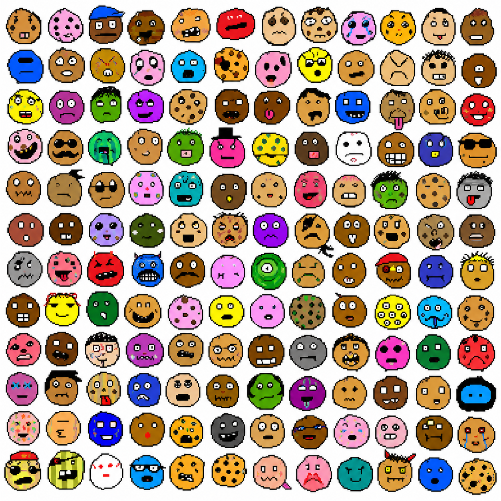
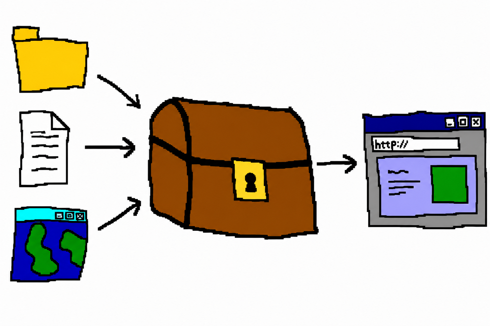
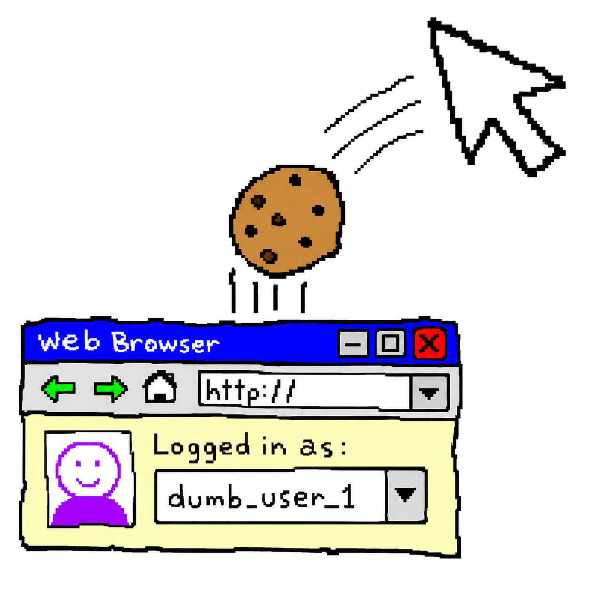
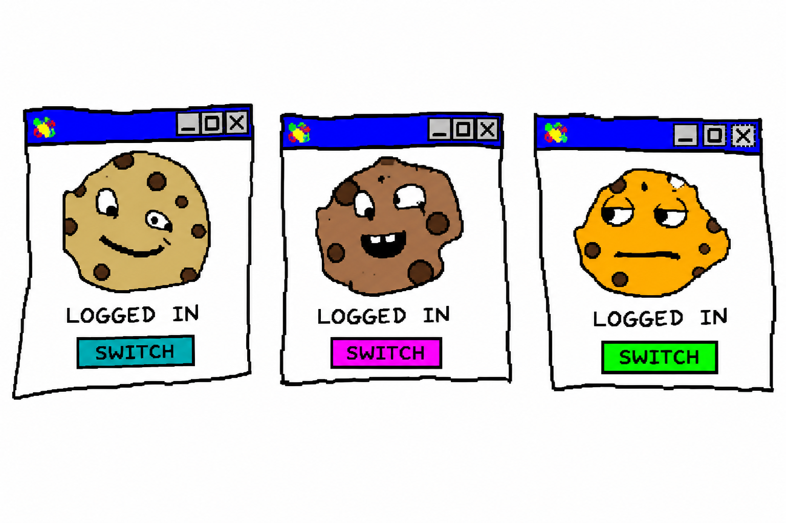
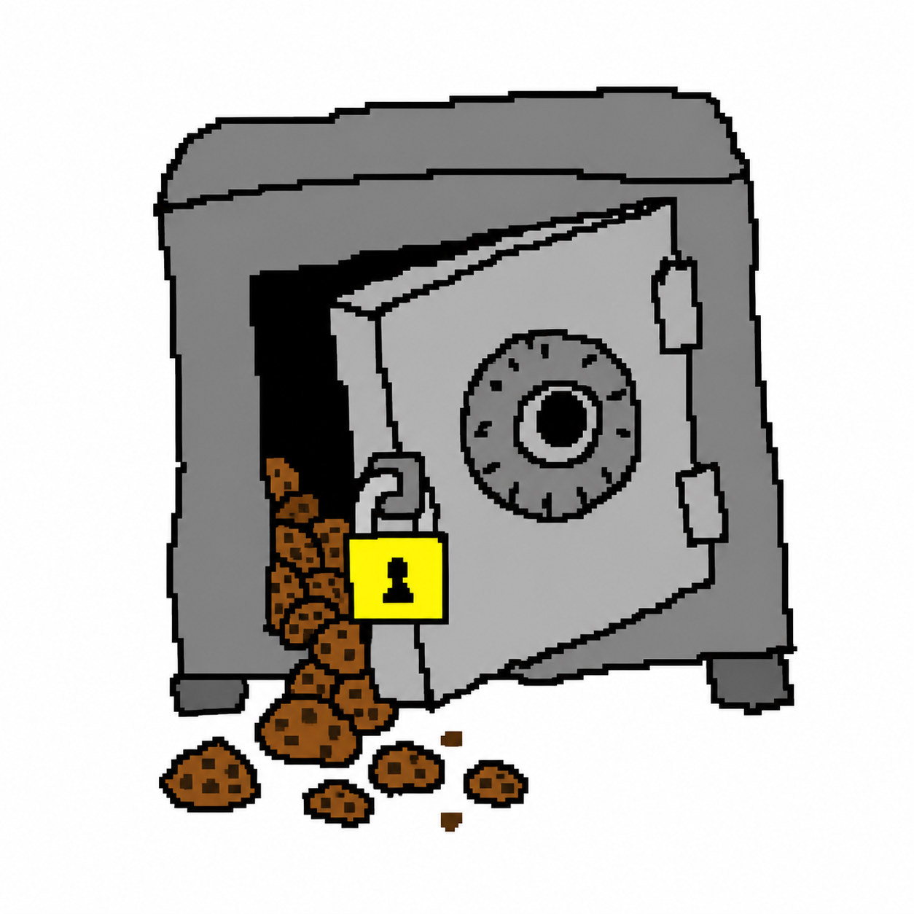

# cookie-use

<p align="center">
  
</p>

**Agent-friendly multi-account session manager.** Capture, store, and apply
logged-in sessions for *any* website — across browsers, profiles, and isolated
contexts. Built for the case where you have many accounts on one site (e.g. 100
ChatGPT accounts) and want an agent to freely list, pick, and switch between
them.

<p align="center">
  <br>
  <em>yes, all of these. one tool.</em>
</p>

cookie-use is **site-agnostic**: you name a domain, it manages that domain's
session. Nothing about ChatGPT, Claude, or any specific site is hardcoded.

It sits on top of [`chrome-use`](https://github.com/leeguooooo/chrome-use): all
browser and cookie I/O (decrypting a profile's cookies, injecting into a live
browser, launching isolated contexts) is delegated to `chrome-use`. cookie-use
owns the **account model**, an **encrypted vault**, and the **orchestration**.

> macOS first (uses the Keychain for the vault key and `chrome-use`'s macOS
> cookie decryption). Other platforms are a follow-up.

## Mental model

<p align="center">
  
</p>

Many sources go *into* one locked box; one chosen account comes back *out* into a
browser.

```
        capture                       apply
profiles ─┐                      ┌─► real Chrome profile  (via chrome-use)
files ────┼─► [ encrypted vault ]┼─► isolated context     (fresh browser)
browser ──┘     N accounts/site  └─► connected session    (chrome-use --session)
```

An **account** is one stored session for one site: its full cross-domain cookie
set plus metadata (id, site, label, account hint, timestamps, status). The vault
holds many accounts across many sites, encrypted at rest.

## Install

```sh
curl -fsSL https://raw.githubusercontent.com/leeguooooo/cookie-use/main/install.sh | sh
```

Requires `chrome-use` on PATH (`curl -fsSL https://raw.githubusercontent.com/leeguooooo/chrome-use/main/install.sh | sh`).

### As an agent skill (skills.sh)

Install the cookie-use skill into your agent so it knows how to drive the CLI
(it self-heals the binary on first use):

```sh
npx skills add leeguooooo/cookie-use
```

See <https://www.skills.sh/docs>. The skill lives at `skills/cookie-use/SKILL.md`.

## Commands (v0.1 MVP)

<p align="center">
  
</p>

| Command | Does |
|---|---|
| `cookie-use add --from-profile <profile> --site <domain[,domain]> [--id <id>] [--with-localstorage]` | Import a logged-in session from a Chrome profile (any site); optionally snapshot localStorage |
| `cookie-use import --file <f> --site <domain> --id <id>` | Import from a JSON / cURL / Cookie-header export |
| `cookie-use list [--site <domain>]` | List stored accounts (id, site, hint, status, last used) |
| `cookie-use show <id>` | Account metadata (never prints cookie values) |
| `cookie-use use <id> [--target session:<s>\|isolated] [--rewrite-domain <host>] [--open-url <url>]` | Apply an account into a browser target |
| `cookie-use switch <id> --target <…>` | Clear the site's cookies in the target, then apply (clean switch) |
| `cookie-use check <id>` | Liveness from cookie expiry (generic; site probes are pluggable later) |
| `cookie-use rm <id>` / `rename <id> <new>` | Manage entries |

`--site` accepts a comma-separated domain list so multi-host auth (e.g.
`chatgpt.com,openai.com`) is captured as one account. Suffix matching also
catches subdomains.

### Cross-origin testing (reuse a prod login on `localhost`)

Cookies are domain-bound, so a session captured on `app.example.com` is invisible
to a local dev server on `localhost`. `--rewrite-domain` retargets the cookie
domains on apply, and `--with-localstorage` / auto-injection carries any SPA
token/user state that lives in `localStorage` rather than cookies:

```sh
cookie-use add --from-profile auto --site example.com --id app/prod --with-localstorage
cookie-use use app/prod --target session:real \
  --rewrite-domain localhost --open-url http://localhost:8001
```

This fixes domain-binding and storage only. If the dev server points at a
different backend/gateway than prod, that token may not be honored there — an
environment-config matter outside cookie-use's scope.

<p align="center">
  <br>
  <em>apply any stored account into a real profile, an isolated browser, or a connected session.</em>
</p>

## Vault & security

<p align="center">
  
</p>

- Location: `~/.cookie-use/vault.enc` (AES-256-GCM encrypted blob).
- Master key: generated on first run, stored in the macOS Keychain
  (service `cookie-use`, account `vault-key`). Cookie values never touch disk in plaintext.
- `show` / `list` never print secret values; errors never echo them.

## Roadmap (post-MVP)

1. Interactive capture: `capture` (log in once → snapshot) and `grab` (pull the
   current account out of a running browser via the chrome-use extension).
2. `run --site <d> --all -- <cmd>`: concurrent orchestration over isolated
   contexts (operate dozens of accounts in parallel).
3. Generalized headless / direct-API backend.
4. MCP server wrapping the same core for agents.
5. Anti-correlation: per-account proxy + fingerprint binding (the vault already
   reserves `proxy` / `fingerprint` fields).

## Relationship to chrome-use

cookie-use shells out to `chrome-use`. As it stabilizes, the shared cookie/crypto
engine may be extracted into a common crate used by both.
