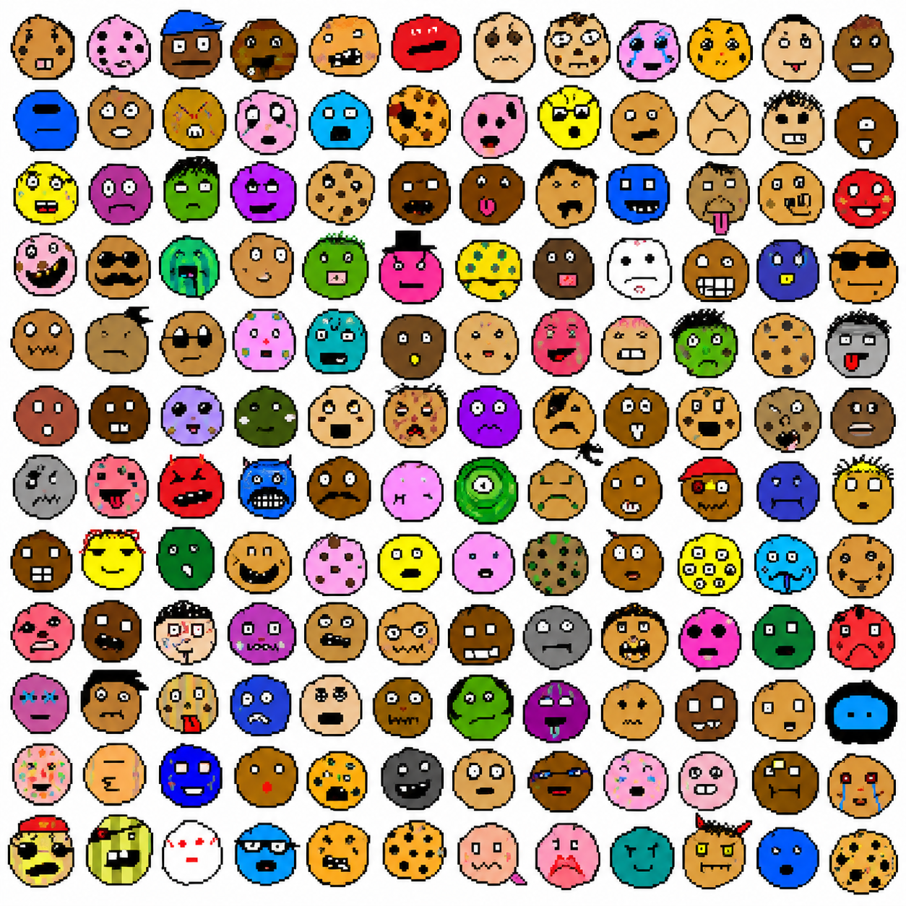
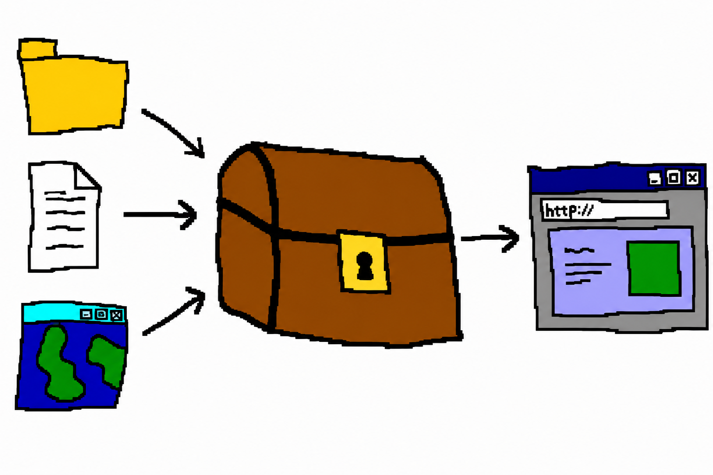
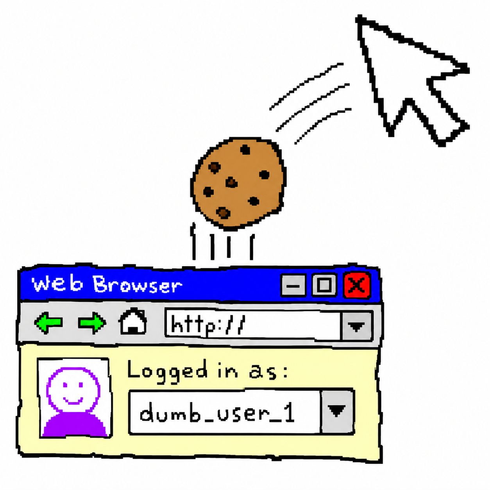
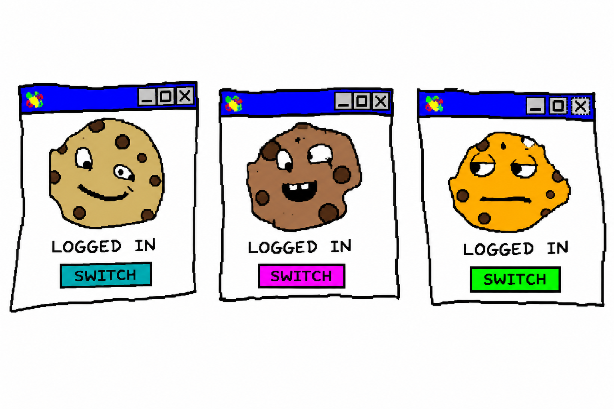
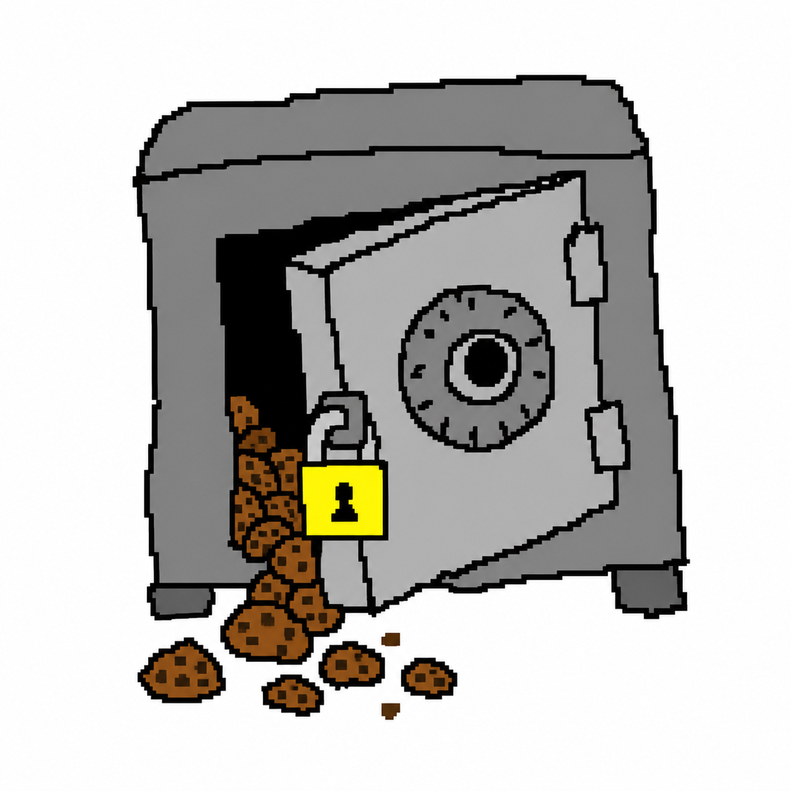

# cookie-use

<p align="center">
  
</p>

**Agent-friendly multi-account session manager.** Capture, store, and apply
logged-in sessions for *any* website — across browsers, profiles, and isolated
contexts. Built for the case where you have many accounts on one site (e.g. 100
ChatGPT accounts) and want an agent to freely list, pick, and switch between
them.

<p align="center">
  <br>
  <em>yes, all of these. one tool.</em>
</p>

cookie-use is **site-agnostic**: you name a domain, it manages that domain's
session. Nothing about ChatGPT, Claude, or any specific site is hardcoded.

It sits on top of [`chrome-use`](https://github.com/leeguooooo/chrome-use): all
browser and cookie I/O (decrypting a profile's cookies, injecting into a live
browser, launching isolated contexts) is delegated to `chrome-use`. cookie-use
owns the **account model**, an **encrypted vault**, and the **orchestration**.

> macOS first (uses the Keychain for the vault key and `chrome-use`'s macOS
> cookie decryption). Other platforms are a follow-up.

## Mental model

<p align="center">
  
</p>

Many sources go *into* one locked box; one chosen account comes back *out* into a
browser.

```
        capture                       apply
profiles ─┐                      ┌─► real Chrome profile  (via chrome-use)
files ────┼─► [ encrypted vault ]┼─► isolated context     (fresh browser)
browser ──┘     N accounts/site  └─► connected session    (chrome-use --session)
```

An **account** is one stored session for one site: its full cross-domain cookie
set plus metadata (id, site, label, account hint, timestamps, status). The vault
holds many accounts across many sites, encrypted at rest.

## Install

```sh
curl -fsSL https://raw.githubusercontent.com/leeguooooo/cookie-use/main/install.sh | sh
```

Requires `chrome-use` on PATH (`curl -fsSL https://raw.githubusercontent.com/leeguooooo/chrome-use/main/install.sh | sh`).

### Upgrade

```sh
cookie-use upgrade                 # install the latest release of the CLI (skills are only listed)
cookie-use upgrade --skills        # ...and refresh the cookie-use skill (plugin / git checkout)
cookie-use upgrade --tag v0.4.0    # install that exact release (also downgrades)
cookie-use upgrade --check         # change nothing: "cookie-use 0.3.0 -> 0.3.1" or "... is up to date"
cookie-use upgrade --json          # the same as JSON, with the install channel and skill copies
```

`upgrade` reinstalls through `install.sh` into the directory the running binary
lives in. The release tarball must match its published `.sha256` (a missing
checksum is a failure), the new binary must run and report the expected version,
and it replaces the old one with a single rename, so any failure leaves the
current binary as it was. A binary owned by Homebrew, cargo or a source build is
not touched; `upgrade` prints the command for that channel and exits 1. The
upgrade never opens the vault, asks for its key or touches browsers. The
CookieUse.app GUI is a separate install and is only reported
(`install-app.sh` updates it).

Skills are opt-in: plain `upgrade` lists each copy of the skill and how to
refresh it; `--skills` runs `claude plugin update cookie-use@leeguooooo-plugins`
for the Claude Code plugin and `git pull --ff-only` for a cookie-use git
checkout, and prints `npx skills update cookie-use` for a copied folder (never
re-copied, so local edits stay). Exit code 2 means the check, download or
verification failed. Other commands check for a newer release at most once a
day, in the background (2 s timeout, cached in
`${XDG_CACHE_HOME:-~/.cache}/cookie-use/update-check.json`), and while one
exists print one line to stderr on each run. `COOKIE_USE_NO_UPDATE_CHECK=1`,
`USE_NO_UPDATE_CHECK=1` or `CI` turn that off.

### Mac app (CookieUse.app)

```sh
curl -fsSL https://raw.githubusercontent.com/leeguooooo/cookie-use/main/install-app.sh | sh
```

Or download `CookieUse.dmg` from the [latest release](https://github.com/leeguooooo/cookie-use/releases/latest).
It is Developer ID signed and notarized by Apple, so it opens on a double-click.

A menu-bar quick switcher over the same vault the CLI and your agents use:

- **⌥⌘K from anywhere**: type to filter by name, site, tag or note; ↩ signs
  Chrome in as that account, ⌘↩ opens it in a separate window, ⌘1–9 jumps to
  pinned and recent accounts.
- **Save a login without typing profile names**: paste a URL (or take Chrome's
  current tab), and the app checks every Chrome profile and lists the ones
  with cookies for that site, most cookies first.
- **Manager window**: sites with their favicons (read from Chrome's local
  cache, never fetched), tags, notes, pins, accounts that have expired or
  will soon, "Refresh login", side-by-side windows, encrypted share bundles.
  Drop a `.cusession` or a cookie export onto the window, or double-click a
  bundle, to import it.
- Touch ID before injecting (every time, once per 10 minutes, or never), and
  live updates when an agent changes the vault from a terminal.
- Copy a login between Chrome profiles (with a preview and Undo), export
  logins to a file, and cloud sync through a CookieCloud server (every 5 /
  15 / 60 minutes).

### As an agent skill (skills.sh)

Install the cookie-use skill into your agent so it knows how to drive the CLI
(it self-heals the binary on first use):

```sh
npx skills add leeguooooo/cookie-use
```

See <https://www.skills.sh/docs>. The skill lives at `skills/cookie-use/SKILL.md`.

## Commands

<p align="center">
  
</p>

| Command | Does |
|---|---|
| `cookie-use add --from-profile <profile> --site <domain[,domain]> [--id <id>] [--with-localstorage]` | Import a logged-in session from a Chrome profile (any site); optionally snapshot localStorage |
| `cookie-use import --file <f> --site <domain> --id <id>` | Import from a JSON / cURL / Cookie-header export |
| `cookie-use list [<site>]` | List stored accounts, grouped by website. `<site>` filters by a domain **or full URL** (e.g. `cookie-use list dash.cloudflare.com` or `cookie-use list https://dash.cloudflare.com/`). |
| `cookie-use show <id>` | Account metadata (never prints cookie values) |
| `cookie-use use <id> [--target session:<s>\|isolated] [--rewrite-domain <host>] [--open-url <url>]` | Apply an account into a browser target |
| `cookie-use switch <id> --target <…>` | Sign the site's previous account out, then apply (clean switch). Only cookies known for that site are expired — other sites stay signed in |
| `cookie-use check <id>` | Liveness from cookie expiry (generic; site probes are pluggable later) |
| `cookie-use fingerprint <id> \| --all [--json]` | Export a **hash-only** fingerprint (SHA-256 of each cookie value, never the value) so another tool can verify a live session is this account. Cached in a plaintext sidecar; reads need no decrypt |
| `cookie-use replay <id> --to localhost:8001` | Cross-origin QA sugar: rewrite domain + open the dev origin in one command |
| `cookie-use run <id> \| --site <d> --all \| --all` | Open one or many accounts in **side-by-side isolated windows** at once |
| `cookie-use as <id> --target <…> -- <cmd>` | Run `<cmd>` in a session-scoped env (`COOKIE_USE_*`, `CHROME_USE_SESSION`) — an agent acts **as** that account |
| `cookie-use share <id> [--out <f>] [--password <pw>]` | Export a **password-encrypted** `.cusession` bundle (argon2id + AES-256-GCM) |
| `cookie-use redeem <f> [--password <pw>] [--id <new>]` | Import a shared bundle (installing cookie-use is the cost of redeeming) |
| `cookie-use copy --site <d> --from <profile> --to <profile> [--dry-run]` | Overwrite one Chrome profile's login for a site with another's. Only that site's cookies change; the destination's old login is saved to the vault first (tag `backup`) so it can be restored |
| `cookie-use export [ids…] [--site <d>] --out <f> [--password]` | Many accounts in one encrypted bundle for another computer; `redeem` it there (newer copy of each account wins) |
| `cookie-use cloud setup\|sync\|pull\|status\|secret\|domains\|import\|disconnect` | Sync the vault between computers through a private GitHub repo or a [CookieCloud](https://github.com/easychen/CookieCloud) server (see below) |
| `cookie-use edit <id> [--label] [--hint] [--note] [--tags a,b]` | Edit metadata (`""` clears a field). Tags and notes are searchable via `list` |
| `cookie-use rm <id>` / `revoke <id>` / `rename <id> <new>` | Manage entries |
| `cookie-use wipe [--yes]` | Delete the entire vault |

Injecting a live session (`use` / `switch` / `replay` / `as`) is gated by
**Touch ID** (falling back to a TTY prompt); agents pass `--no-confirm` or set
`COOKIE_USE_YES=1`, and injection is refused — never silent — in a
non-interactive shell without a bypass.

`--site` accepts a comma-separated domain list so multi-host auth (e.g.
`chatgpt.com,openai.com`) is captured as one account. Suffix matching also
catches subdomains.

### In action

Switch between accounts in your real browser — no re-login:

```sh
chrome-use extension connect                          # connect a session to your Chrome
cookie-use switch cloudflare/work --target session:default   # Touch ID, then you're that account
cookie-use switch cloudflare/personal --target session:default
```

Run many accounts of one site side by side, each in its own isolated window:

```sh
cookie-use run --site chatgpt.com --all
```

Let an agent act as a specific account for one task (headless-friendly):

```sh
COOKIE_USE_YES=1 cookie-use as chatgpt/seat-07 --target session:agent -- \
  chrome-use open https://chatgpt.com
```

Hand a login to a teammate as an encrypted bundle (they must install cookie-use to redeem):

```sh
cookie-use share chatgpt/seat-07 --out seat.cusession   # prompts for a password
cookie-use redeem seat.cusession --id chatgpt/seat-07   # on their machine
```

### Move logins between profiles, computers and the cloud

```sh
# Profile → profile: Work's Cloudflare login replaces Leo's (other sites untouched).
cookie-use copy --site dash.cloudflare.com,cloudflare.com --from "Profile 3" --to Default --dry-run
cookie-use copy --site dash.cloudflare.com,cloudflare.com --from "Profile 3" --to Default

# Computer → computer, as a file.
cookie-use export --out all.cusession          # on the old Mac (asks for a password)
cookie-use redeem all.cusession                # on the new one

# Keep several Macs in sync — through a private GitHub repo (no server; uses your `gh` login)…
cookie-use cloud setup --github you/cookie-use-sync --create      # first Mac: prints the password
cookie-use cloud setup --github you/cookie-use-sync --password …  # other Macs
cookie-use cloud sync
# …or a CookieCloud server.
cookie-use cloud setup --endpoint https://cookiecloud.example.com  # prints uuid + password
```

`copy` writes into the destination through the chrome-use extension, so that
profile has to be open in Chrome with the extension connected
(`chrome-use browsers`). Nothing outside the site changes: cookies are
expired one by one, never cleared wholesale.

**GitHub private repo.** The vault is sealed into one `.cusession` file
(argon2id + AES-GCM, the same format as `export`, so it can also be `redeem`ed
by hand) and committed through `gh`. Public repos are refused. Two Macs pushing
at once can't overwrite each other: GitHub rejects the stale write, and the
loser re-pulls, merges and pushes again.

**CookieCloud compatibility.** Any CookieCloud server works, self-hosted
(`docker run -p 8088:8088 easychen/cookiecloud`) or public. The upload uses
CookieCloud's own encryption (`aes-128-cbc-fixed` by default, `legacy` for
older extensions) and payload shape. Inside it, cookie-use's full multi-account
vault is sealed a second time with argon2id + AES-GCM, because CookieCloud's
MD5-derived key is weak and its format keeps one login per domain. Two-way
with the CookieCloud browser extension:
- what cookie-use pushes includes the most recently used login per site in
  CookieCloud's `cookie_data`, so the extension can download it into a browser
  (turn off with `--no-browser-compat`);
- what the extension uploaded can be listed (`cloud domains`) and imported as
  accounts (`cloud import github.com --id github/me`), keeping real expiry
  dates (the extension itself drops them). `cloud sync` refuses to overwrite
  an extension's upload unless you pass `--force`.

Per account the newer copy wins; deletes and renames propagate.

### Cross-origin testing (reuse a prod login on `localhost`)

Cookies are domain-bound, so a session captured on `app.example.com` is invisible
to a local dev server on `localhost`. `--rewrite-domain` retargets the cookie
domains on apply, and `--with-localstorage` / auto-injection carries any SPA
token/user state that lives in `localStorage` rather than cookies:

```sh
cookie-use add --from-profile auto --site example.com --id app/prod --with-localstorage
cookie-use use app/prod --target session:real \
  --rewrite-domain localhost --open-url http://localhost:8001
```

This fixes domain-binding and storage only. If the dev server points at a
different backend/gateway than prod, that token may not be honored there — an
environment-config matter outside cookie-use's scope.

<p align="center">
  <br>
  <em>apply any stored account into a real profile, an isolated browser, or a connected session.</em>
</p>

## Vault & security

<p align="center">
  
</p>

- Location: `~/.cookie-use/vault.enc` (AES-256-GCM encrypted blob).
- Master key: generated on first run, stored in the macOS Keychain
  (service `cookie-use`, account `vault-key`). Cookie values never touch disk in plaintext.
- `show` / `list` / `fingerprint` never print secret values; errors never echo them.
- `fingerprint` keeps a **plaintext** sidecar (`~/.cookie-use/fingerprints.json`)
  holding only SHA-256 hashes of cookie values plus names/scope — safe at rest, and
  readable without the Keychain or a vault decrypt. Cookie values themselves live
  only in the encrypted vault. `wipe` deletes the sidecar too.
- Headless / CI / agent hosts: set `COOKIE_USE_VAULT_KEY` (base64 of 32 bytes) to
  supply the key directly and skip the Keychain, and `COOKIE_USE_VAULT` to point
  at an alternate vault file.

## Roadmap

Shipped: `run` (side-by-side isolated windows), `as` (act as an account for a
command), `share` / `redeem` (encrypted session bundles), Touch ID injection gate.

Next:

1. Interactive capture: `capture` (log in once → snapshot) and `grab` (pull the
   current account out of a running browser via the chrome-use extension).
2. `run … -- <cmd>`: fan a command across every isolated context concurrently
   (operate dozens of accounts in parallel), building on today's `run`.
3. Generalized headless / direct-API backend.
4. MCP server wrapping the same core for agents.
5. Anti-correlation: per-account proxy + fingerprint binding (the vault already
   reserves `proxy` / `fingerprint` fields).

## Relationship to chrome-use

cookie-use shells out to `chrome-use`. As it stabilizes, the shared cookie/crypto
engine may be extracted into a common crate used by both.

## Releasing

Add notes under `[Unreleased]` in CHANGELOG.md, then `scripts/release.sh <version>` (`--dry-run` to only check): it bumps, tests, pushes only the `v<version>` tag, waits for the release build, then pushes `main` and syncs the `leeguooooo/plugins` marketplace.

<!-- use-family -->
## The `*-use` family

Small, composable CLIs that give an AI agent hands on one real thing. Same shape
everywhere: `curl … install.sh | sh` to install, `npx skills add leeguooooo/<name>`
to teach your agent, JSON on stdout.

| Repo | Gives your agent |
|---|---|
| [chrome-use](https://github.com/leeguooooo/chrome-use) | A real browser — logged-in sessions, forms, scraping, screenshots |
| [mail-use](https://github.com/leeguooooo/mail-use) | Email — read, search, send, triage across Gmail / QQ / 163 / any IMAP |
| [iphone-use](https://github.com/leeguooooo/iphone-use) | A real iPhone — tap, type, screenshot, pull on-device data |
| [wechat-use](https://github.com/leeguooooo/wechat-use) | WeChat on macOS — send messages, query contacts and history |
| [discord-use](https://github.com/leeguooooo/discord-use) | Discord — messages, channels, forums, webhooks (REST-only, Rust) |
| [profile-use](https://github.com/leeguooooo/profile-use) | Your personal profile, safely — fill signup / KYC / checkout forms |
| [bitwarden-use](https://github.com/leeguooooo/bitwarden-use) | Bitwarden / Vaultwarden — headless passkey (FIDO2) login |
| [chatgpt-use](https://github.com/leeguooooo/chatgpt-use) | Your ChatGPT subscription as a coding-agent backend — no API key |
| [computer-use](https://github.com/leeguooooo/computer-use) | The macOS desktop itself |
| [pixcake-use](https://github.com/leeguooooo/pixcake-use) | Read-only PixCake probing — snapshot / diff / SQLite inspection |
